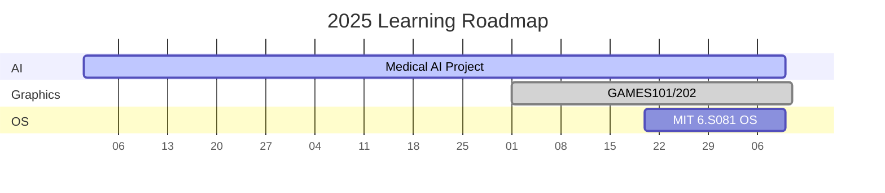

## Why This Exists

As an autodidact in computer science, I maintain this knowledge base to:

- **Solidify understanding** through deliberate note-taking
- **Track progress** across domains with measurable milestones

## Core Competencies

### 🎮 Computer Graphics (150+ hrs)

- **[GAMES101](https://sites.cs.ucsb.edu/~lingqi/teaching/games101.html)**

  - Rasterization, Geometry, Ray tracing and Animation/Simulation
  - [View codes](https://github.com/lzhangdu/GAMES101)
  - Key Insights:
    - "The beauty of barycentric coordinates in triangle rasterization"
    - "Why Monte Carlo integration beats analytic solutions for complex BRDFs"

- **[GAMES202](https://sites.cs.ucsb.edu/~lingqi/teaching/games202.html)**
  - (Real-Time High Quality Rendering)
  - [View codes](https://github.com/lzhangdu/GAMES202)

### 🖥️ Operating Systems (20+ hrs)

- **MIT 6.S081** (xv6 OS)

### 🌐 Web Development

- **MIT Web.lab**

## Resource Curation

## Current Focus

